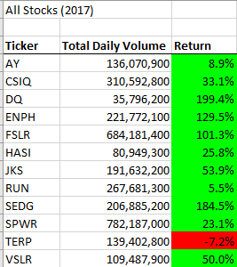
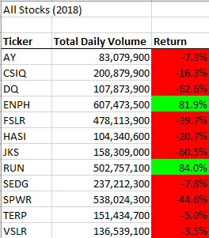
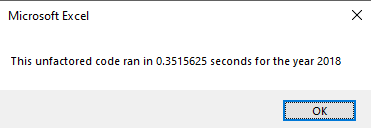
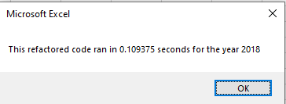

# Stocks Analysis with VBA
#### Analysis by Frank Feder for UT Austin Data Analysis Bootcamp January 2021
## Overview of Project
This analysis summarizes a collection of provided data relating to daily performance of 12 companies' stocks over a two year period (2017-2018). The focus of this analysis will be identifying which companies' stocks performed best during the analyzed period, so as to best advise a client looking to buy stocks.
From a technical perspective, this project demonstrates the power of VBA macros. I'll also touch on how refactoring a macro to use nested loops improved the efficiency of the programmatic analysis.

## Results
### Stock Performance
This analysis uses VBA to cycle through each record in the worksheet for the year speficied by the user (2017 or 2018), output summaries for each company's Total Daily Volume and yearly Return, and format that output to make it easier to read. 
In 2017, 11 of the 12 companies' stocks included in the data had a higher ending price than starting price:

In 2018, only 2 of the 12 companies' stocks ended at a higher price than they had started:

Based on these results, I would feel most confident about recommending a client to buy stock in ENPH (2017 up 129.5%, 2018 up 81.9%) as in both years the stock posted more consistent growth than any other in this data. After that I would advise a client to consider buying stock in RUN, as it was up in both 2017 and 2018 - although it was only up 5% in 2017, being up 84% in 2018 (a year when a majority of comparable companies were in the red) seems like a reasonable justification to invest.

### Code Performance
As part of this project I first built a macro to summarize one company's stocks, then changed that code to allow analysis of all companies' stock data, then refactored that macro to improve performance. Below I will show the differences in runtime between the unfactored and refactored versions for 2018, although the differences for 2017 are very similar and can be found in the /Resources folder of this repo.

Originally, the macro would iterate through all records to pull the summary about one company, output that summary to the results worksheet, then repeat that process for the next company until finished. The refactored version stores the summary info about each company in arrays as it iterates once through all records, then outputs those arrays onto the results page.

Here's the output from the unfactored version for the 2018 data:

After applying the above changes to the code, the refactored version runs much faster for the same data:

As you can see, the runtime was reduced by about 66%. This can be attributed to grouping related steps together to reduce the number of iterations through the data (originally 12 iterations, now 1) and to prevent the macro from having to flip back and forth between worksheets (originally 23 worksheet changes, now 1). 

## Summary
### What are the advantages or disadvantages of refactoring code?
Refactoring code should improve performance and readability, but sometimes a refactor can tip the scales towards one of these and away from the other. When working on a refactor it's easy to mistake "runtime" as the only relevant metric - time is money, and it costs time to run code, so if we reduce that time we save money. The reality is that poorly implemented time-saving fixes can create confusion for future developers attempting to modify code, and sorting out confusion costs time (money!). On the other hand, we need the code to run fast enough to provide value to the user. A developer's job is finding the sweet spot between readability and efficiency, to provide the most possible value to their organization.

### How do these pros and cons apply to refactoring the original VBA script?
Although the original script worked, it was taking 0.3 seconds instead of the refactored 0.1. Yes, this is three times longer, but the client for this "job" is a buddy, Steve. If Steve was running this analysis on a much larger dataset, or much more frequently, a 3x performance improvement would almost certainly be worth the developer time to implement. But the refactor costs us time - time that Steve is tapping his foot, trying to keep his investors on the line, wondering why we're not done yet. If we tell Steve that we spent 30 minutes restructuring our code to save him 0.2 seconds, Steve will likely not be happy. So in this case, refactoring the code did not provide much additional value to our organization (our buddy Steve).